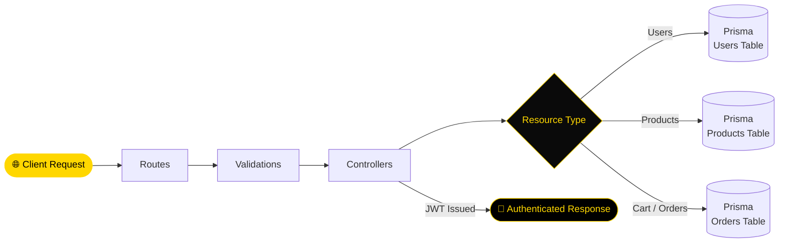

<div align="center">


[](https://git.io/typing-svg)

<br/>

<p align="center">
  <a href="https://github.com/NietoDeveloper">
    
  </a>
  <a href="https://committers.top/colombia#NietoDeveloper">
    
  </a>
  <a href="https://nodejs.org/">
    
  </a>
  <a href="https://expressjs.com/">
    
  </a>
  <a href="https://www.prisma.io/">
    
  </a>
  <a href="https://opensource.org/licenses/MIT">
    
  </a>
</p>

<p align="center">
  <a href="https://github.com/NietoDeveloper/Server-CannOil_1.1">
    
  </a>
</p>

</div>

---

## 📋 Overview

The backend for **Cannoil E-Commerce** — a model application for an online health products store. Built by **Manuel Nieto**, Software Developer, in 2024. Exposes a RESTful API handling product management, user authentication, and order processing, backed by Prisma-managed database migrations.

---

## 🗂️ Project Structure

```text
Server-CannOil_1.1/
├── migrations/          # Prisma database migrations (users, products, categories, cart/orders, blog)
├── public/
│   └── uploads/          # Uploaded media assets
└── src/
    ├── controllers/       # Business logic handlers
    ├── generated/          # Prisma generated client
    ├── models/             # Data models
    ├── routes/             # RESTful API endpoints
    └── validations/        # Request validation schemas
```

---

## 🔄 API Request Flow



---

## 🛠️ Technologies

<div align="center">

| Category | Technologies |
|:---------|:-------------|
| 🏃 **Runtime** | Node.js |
| ⚙️ **Framework** | Express (web framework for API development) |
| 🗄️ **ORM** | Prisma |
| 🔐 **Security** | JWT, Bcrypt |

</div>

---

## ✨ Features

- **RESTful API for Product Management:** Full CRUD endpoints for the product catalog.
- **User Authentication and Authorization:** JWT-based, securing protected routes.
- **Order Processing:** Cart and order lifecycle management.
- **Database Integration:** Prisma ORM with versioned migrations for users, products, categories, cart/orders, and blog entities.

---

## 🚀 Installation

**Step 1 — Clone the repository**

```bash
git clone https://github.com/NietoDeveloper/Server-CannOil_1.1
```

**Step 2 — Navigate to the backend directory**

```bash
cd Cannoil-Ejemplo1/server
```

**Step 3 — Install dependencies**

```bash
npm install
```

**Step 4 — Start the server**

```bash
npm start
```

---

## 📖 Usage

- API runs on `http://localhost:3000`.
- Endpoints for products, users, and orders available.

---

## 🤝 Contributing

Fork the repo and submit a pull request with your changes.

---

## 📄 License

This project is licensed under the **MIT License**.

---

## 👨‍💻 Author

Created by **Manuel Nieto (NietoDeveloper)**. Reach out via [GitHub](https://github.com/NietoDeveloper).

<div align="center">

<br/>


</div>
